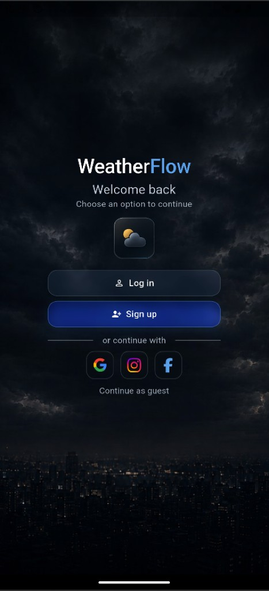
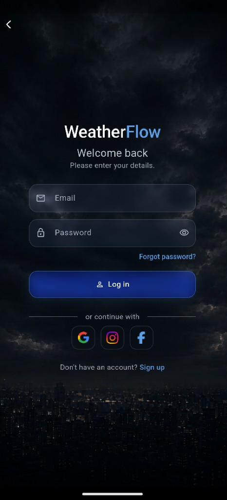
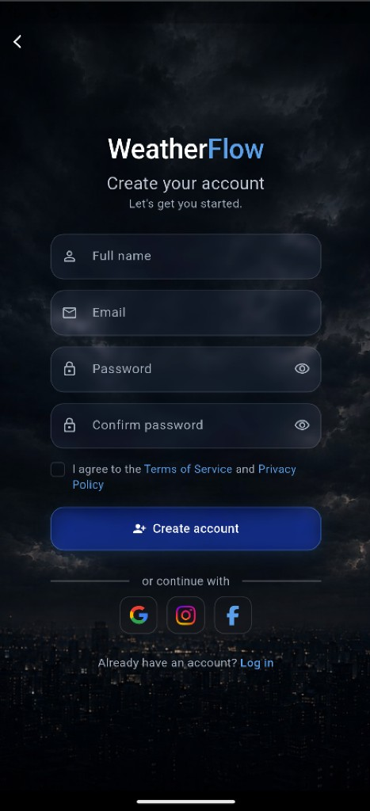
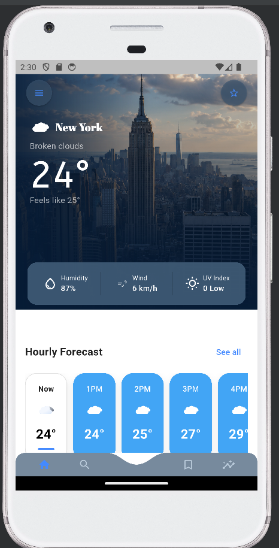
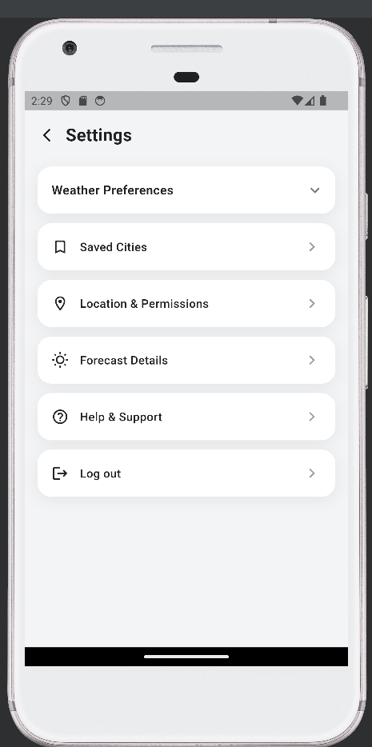
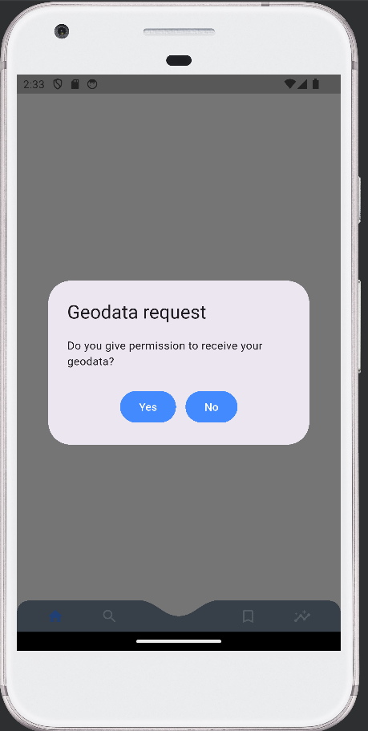

## WeatherFlow (Flutter) — Work in Progress

A Flutter weather application I am building in my free time as a learning and portfolio project.

The app shows current weather, hourly and 7-day forecasts, and includes auth via Supabase. Branding and auth screens follow the **WeatherFlow** dark glass UI. I am gradually moving the codebase toward **Clean Architecture** and improving layer boundaries between features.

---

## Screenshots

**Auth — WeatherFlow glass UI (updated)**

| Welcome | Login | Sign up |
|:---:|:---:|:---:|
|  |  |  |

- **Welcome** — full-bleed night city background, WeatherFlow wordmark, brand icon, Log in / Sign up CTAs, social row, Continue as guest  
- **Login** — glass email/password fields, Forgot password, primary Log in button, social continue, link to Sign up  
- **Sign up** — full name / email / password / confirm, Terms checkbox, Create account CTA, social continue, link to Log in  

**Weather & settings**

| Main weather | Settings | Location permission |
|:---:|:---:|:---:|
|  |  |  |

---

## Recent changes (WeatherFlow auth + shell)

- Redesigned **Welcome / Login / Sign up** with dark atmospheric backgrounds and shared glass widgets (`AuthScaffold`, `AuthGlassField`, `AuthGlassButton`, `AuthSocialRow`)
- Added WeatherFlow brand assets (icon, welcome/login backgrounds, social icons)
- Welcome route normalized (`/welcome`); guest and success auth navigate into the weather flow
- Added **city search** feature (domain / data / presentation + cubit)
- Added **WeatherMainShell** with bottom navigation wired to weather + city search tabs
- GetIt registrations for city search use case / repository / cubit

---

## Current Status

### Done

**Auth**
- WeatherFlow Welcome (Log in / Sign up / social row / Continue as guest)
- Login and Sign up with glass fields, validation, Supabase auth
- Shared auth presentation widgets and theme tokens (`AppColors` welcome/auth palette)
- Auth flow fixes (validation, navigation, stack clearing)

**Weather**
- Weather screen with hero (city image + gradient overlay)
- Current weather card (city, temperature, feels like)
- Metrics card (humidity, wind, UV index)
- Hourly forecast (selectable cards)
- 7-day forecast (container with dividers and temperature bars)
- Monthly forecast button (UI stub, no navigation yet)
- Custom bottom navigation bar inside `WeatherMainShell`
- Geo permission dialog → weather by location or default city
- OpenWeather hourly/daily timeline API integration

**City search**
- Search screen with recent / popular city cards
- Cubit + repository wired through GetIt
- Selection loads weather for the chosen city

**Settings**
- Settings screen (card-based UI)
- Weather-related menu items (saved cities, location, forecast details, help)
- Log out

**Core**
- GetIt service locator
- Repository + use case pattern (auth, weather, city search)
- Error mapping (`Failure`, Supabase/weather mappers)
- Named routes + `ScreenFactory`

### In Progress

- Completing remaining bottom navigation tabs (favorites / details placeholders)
- Connecting settings toggles to app behavior
- Architecture cleanup (domain layer boundaries, unified error handling)

### Planned Next

**Short-term**
- Fix weather domain layer (entities independent of data models)
- Single app-scoped `AuthCubit` lifecycle
- Saved cities with local persistence (Hive is declared; recent cities are still in-memory)
- Settings actions with real navigation / state

**Mid-term**
- Monthly / extended forecast screen
- Celsius / Fahrenheit toggle
- Weather alerts notifications
- Dark mode polish across non-auth screens

**Architecture & quality**
- Unify `Result<T>` vs `Either` across features
- Bring settings into data/domain layers
- Unit tests for use cases, repositories, cubits
- Move API keys to environment config (not committed)
- Fix `DefaultCityService` locale logic bug

**Optional (later)**
- Pro subscription / premium features
- Real social auth providers (buttons are UI-ready)
- Guest mode polish

---

## Tech Stack

**Flutter / Dart** — SDK `>=3.3.1 <4.0.0`

| Area | Packages |
|------|----------|
| State | bloc, flutter_bloc |
| Networking | http |
| Backend | supabase_flutter |
| Location | geolocator |
| Functional | dartz |
| DI | get_it |
| UI | google_fonts, lottie, weather_icons_animated, intl |

---

## Project Structure

```
lib/
├── core/                 # DI, config, errors, validators, theme
├── feature/
│   ├── auth/             # data / domain / presentation (WeatherFlow glass UI)
│   ├── weather/          # data / domain / presentation + main shell
│   ├── city_search/      # data / domain / presentation
│   └── settings/         # presentation (to be expanded)
└── navigation/           # routes, ScreenFactory
```

---

## Getting Started

```bash
flutter pub get
flutter run
```

**Note:** API keys for OpenWeather and Supabase are currently in `lib/core/config/configuration/configuration.dart`. I plan to move them to a local env setup before public release.

---

## Branch

Active development: `feature/weather-flow`

Related feature branches (merged into weather-flow):
- `feature/auth-glass-ui` — WeatherFlow auth redesign
- `feature/city-search` — city search + weather shell
